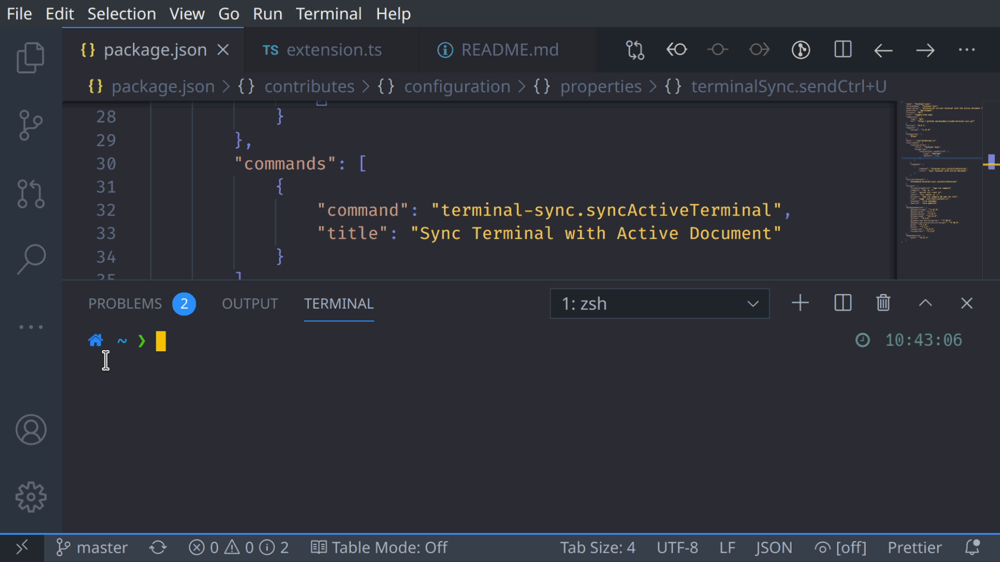
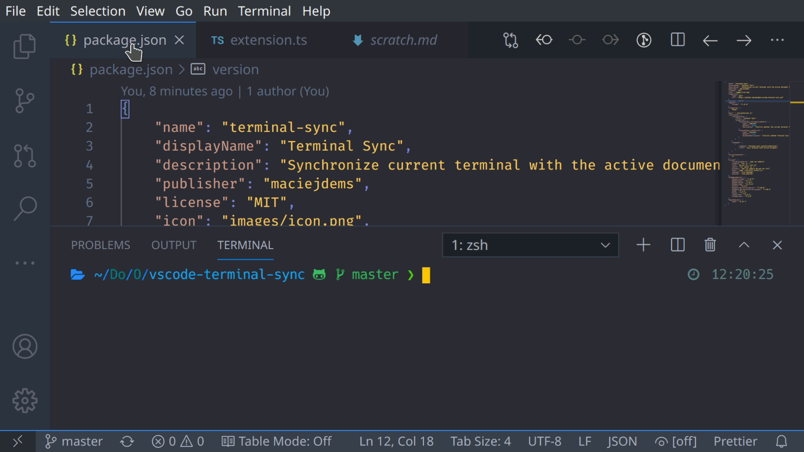

# Terminal Sync README

This is simple extension that allows to synchronize active terminal with the directory of the active document.

It is very surprising, but it seems there is no extension that does just it. No new terminal, no code run, just simple `cd` to the directory of the active document.

It has been verified to work with `bash` and `zsh` on Linux (probably with other shell too) and with `Powershell` on Windows.

## Usage

Press `Shift+Ctrl+P` and select `Sync Terminal with Active Document`. The extension checks the location of the file in the active editor and sends the `cd` command to the active terminal.

If you want, you can assign a keybinding of your choice to this command with `Preferences: Open Keyboard Shortcuts`.

You may also set the `terminalSync.followActiveEditor` configuration option to `true` to automatically follow the active editor. However, you should use it with case, as the extension has no way of knowing if the current process in the terminal is a shell or something else.

## Extension Settings

This extension contributes the following setting:

* `terminalSync.followActiveEditor`: automatically change directory in the terminal when the active editor changes
* `terminalSync.lineClearKey`: key sent to the terminal to clear the content of the current line

## Known Issues

The extension simply sends `cd ...` command to the terminal. It does not check if the current process is a shell or anything else.

## Release Notes

See the [changelog](CHANGELOG.md)
